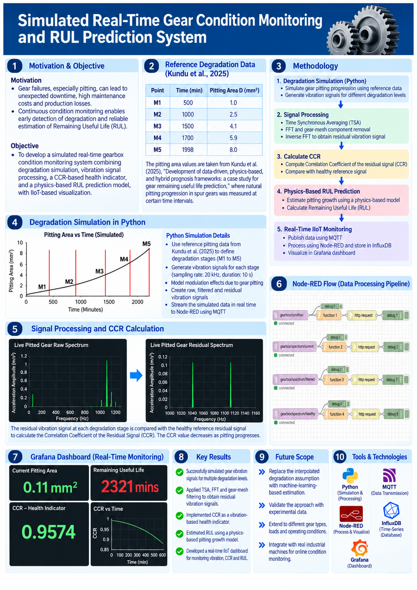

Simulated Real-Time Gear Condition Monitoring & RUL Prediction

A mechanical engineering condition-monitoring project combining gear pitting degradation, vibration signal processing, prognostics, and an IIoT data pipeline.

Project Overview

Gear pitting can progressively reduce gear health and, if left undetected, contribute to unexpected downtime and maintenance costs.

This project builds a simulation-based gear condition monitoring system that connects a mechanical degradation model with vibration analysis and digital monitoring.

The workflow is:

Pitting Area → Synthetic Vibration → TSA → FFT → GMF Analysis → GMF Filtering → Residual Vibration → CCR + RUL → MQTT → Node-RED → InfluxDB → Grafana

The project is intentionally simulation-based: the gearbox vibration is computationally generated rather than acquired from a physical test rig.

What This Project Demonstrates

Mechanical gear pitting degradation modelling

Synthetic vibration signal generation

Time Synchronous Averaging (TSA)

Fast Fourier Transform (FFT)

Gear Mesh Frequency (GMF) analysis

GMF sideband analysis

Residual vibration extraction

Correlation Coefficient (CCR) as a vibration health indicator

Physics-based Remaining Useful Life (RUL) estimation

MQTT-based data transmission

Node-RED data processing

InfluxDB time-series storage

Grafana visualisation

System Architecture

flowchart TD
    A[Reference Gear Pitting Data] --> B[Pitting Area D(t)]
    B --> C[Pitting Degradation Model]
    C --> D[Synthetic Vibration Signal]
    D --> E[Time Synchronous Averaging]
    E --> F[FFT]
    F --> G[GMF + Sidebands]
    G --> H[GMF Filtering]
    H --> I[Residual Vibration]
    I --> J[CCR Health Indicator]
    C --> K[Physics-Based RUL]
    J --> L[MQTT]
    K --> L
    L --> M[Node-RED]
    M --> N[InfluxDB]
    N --> O[Grafana]

Reference Gear Degradation Data

The simulated degradation trajectory uses pitting-area measurements reported in:

Kundu et al. (2025), Development of data-driven, physics-based, and hybrid prognosis frameworks: a case study for gear remaining useful life prediction.

Point

Time (min)

Pitting Area (mm²)

Healthy

0

0.0

M1

500

1.0

M2

1000

2.5

M3

1500

4.1

M4

1700

5.9

M5

1998

8.0

Linear interpolation is used between the reference points to estimate pitting area at intermediate simulation times.

Gear & Simulation Parameters

Parameter

Value

Shaft speed

2400 RPM

Shaft frequency

40 Hz

Number of gear teeth

27

Gear Mesh Frequency (GMF)

1080 Hz

Sampling frequency

20 kHz

Acquisition duration

10 s

Acquisition interval

6 min

Samples per revolution

500

Maximum pitting area

8.0 mm²

Gear Mesh Frequency

The Gear Mesh Frequency is calculated from the number of gear teeth and shaft frequency:

GMF = Number of gear teeth × Shaft frequency
    = 27 × 40
    = 1080 Hz

GMF Sidebands

The first-order sidebands are defined using the shaft rotational frequency:

Lower sideband = GMF - Shaft frequency
               = 1080 - 40
               = 1040 Hz

GMF = 1080 Hz

Upper sideband = GMF + Shaft frequency
               = 1080 + 40
               = 1120 Hz

So the simulated gear-mesh region contains:

1040 Hz — 1080 Hz — 1120 Hz

The sideband amplitudes increase progressively with simulated pitting severity.

Vibration Signal Generation

The healthy vibration signal contains:

Shaft rotational frequency

Gear Mesh Frequency

Random noise

As pitting progresses, GMF sidebands are introduced around the GMF.

Conceptually:

Healthy:
Shaft frequency + GMF + Noise

Pitted:
Shaft frequency + GMF + GMF sidebands + Noise

The sideband amplitude is scaled according to the simulated pitting area.

Signal Processing

1. Time Synchronous Averaging (TSA)

At 2400 RPM:

Shaft frequency = 2400 / 60
                = 40 Hz

With a 20 kHz sampling rate:

Samples/revolution = 20,000 / 40
                   = 500 samples/revolution

For a 10-second acquisition:

Number of revolutions = 40 × 10
                      = 400 revolutions

The vibration signal is therefore reshaped into:

400 revolutions × 500 samples/revolution

and averaged across revolutions to obtain the TSA signal.

2. FFT

The TSA signal is transformed into the frequency domain using FFT.

The resulting spectrum is used to observe:

Shaft frequency

GMF

GMF sidebands

Other frequency components

3. GMF Filtering & Residual Vibration

The GMF component is removed from the FFT spectrum.

TSA Signal
    ↓
   FFT
    ↓
Frequency Spectrum
    ↓
Remove GMF Component
    ↓
Filtered Spectrum
    ↓
Inverse FFT
    ↓
Residual Vibration

The residual vibration is then used for the CCR health indicator.

Condition Indicator: CCR

The Correlation Coefficient (CCR) compares the current residual vibration with the healthy residual reference.

Current Residual
      ↓
Compare with
      ↓
Healthy Residual
      ↓
Correlation Coefficient
      ↓
CCR

In this simulation, a reduction in CCR represents increasing deviation from the healthy vibration condition.

Physics-Based RUL Prediction

A physics-based pitting-growth model is used to estimate Remaining Useful Life.

Simulation parameters:

τ = 196.3 MPa
M = 1.26
log(C) = -21.37
C = exp(log(C))

The defined pitting threshold is:

D_threshold = 8.0 mm²

The model estimates the remaining number of gear cycles until the pitting area reaches the defined threshold and converts the result into operating time using the shaft speed.

Pitting Area
     ↓
Pitting Growth Model
     ↓
Remaining Gear Cycles
     ↓
Remaining Useful Life
     ↓
RUL (minutes)

Accelerated Real-Time Simulation

The reference degradation trajectory spans almost 2000 simulated minutes.

Running this literally would take a long time, so the simulation is accelerated:

Simulated acquisition interval = 6 minutes
Actual program delay            = 2 seconds

This allows the complete degradation trajectory to be demonstrated within a practical runtime while preserving the simulated degradation timeline.

IIoT Data Pipeline

flowchart LR
    A[Python Simulation] -->|MQTT| B[Node-RED]
    B --> C[InfluxDB]
    C --> D[Grafana]

MQTT Topics

Condition data

gearbox/condition

Example:

{
  "time_min": 500,
  "damage_mm2": 1.0,
  "ccr": 0.95,
  "rul_min": 1234.5
}

Vibration spectra

gearbox/spectrum/healthy
gearbox/spectrum/current
gearbox/spectrum/filtered

These topics allow the vibration spectrum and GMF-filtering process to be transferred through the IIoT pipeline.

Technology Stack

Technology

Purpose

Python

Simulation and signal-processing workflow

NumPy

Numerical computation and FFT

Paho MQTT

MQTT communication

MQTT

Data transmission

Node-RED

Data processing and routing

InfluxDB

Time-series data storage

Grafana

Dashboard visualisation

Git

Version control

GitHub

Source-code management and documentation

Project Structure

GearCMM-Project/
│
├── README.md
├── LICENSE
├── .gitignore
├── requirements.txt
│
├── src/
│   └── GearCMM.py
│
├── node_red/
│   └── flow.json
│
├── grafana/
│   └── dashboard.json
│
├── data/
├── plots/
├── results/
└── docs/

Empty directories are included in the local project structure but are not tracked by Git until they contain files.

Project Outputs

The simulation produces three main condition-monitoring indicators:

Indicator

Meaning

Pitting Area

Simulated physical degradation state

CCR

Similarity between current and healthy residual vibration

RUL

Estimated remaining operating time until the pitting threshold

Conceptually:

Pitting Area ─────► Physical Degradation
       │
       ├──────────► CCR ─────► Vibration Condition
       │
       └──────────► RUL ─────► Prognostic Estimate

Current Project Status

The current implementation is a simulation-based gear condition monitoring framework.

The vibration signals are computationally generated rather than acquired from a physical gearbox. The degradation trajectory is based on reference pitting-area data, while the vibration response and sideband behaviour are simulated to demonstrate the complete condition-monitoring workflow.

The current system integrates:

Mechanical Degradation + Vibration Signal Processing + Condition Monitoring + Prognostics + IIoT Data Pipeline + Visualisation

Future Development

Possible extensions include:

Validation using experimental gearbox vibration measurements

Real-time vibration sensor acquisition

Experimental validation of the CCR indicator

Improved physical pitting-growth modelling

Machine-learning-based degradation estimation

Comparison of multiple vibration health indicators

Automated fault classification

RUL validation against experimental failure data

Extension to different gear types and operating conditions

Integration with an industrial condition-monitoring system

Author

Kishore Kumar L S

M.Sc. Advanced Manufacturing
Technische Universität Chemnitz

Disclaimer

This repository is a simulation and learning project. The vibration signals and condition-monitoring response are computationally generated and should not be interpreted as measurements from a physical gearbox.